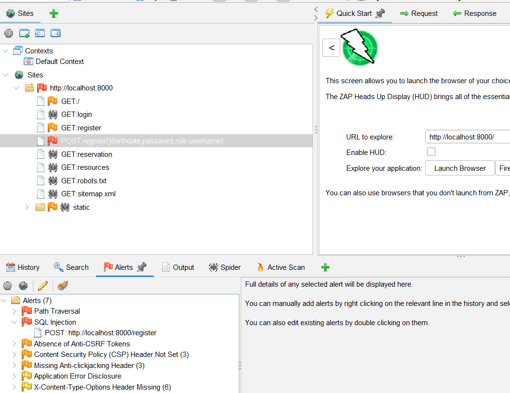
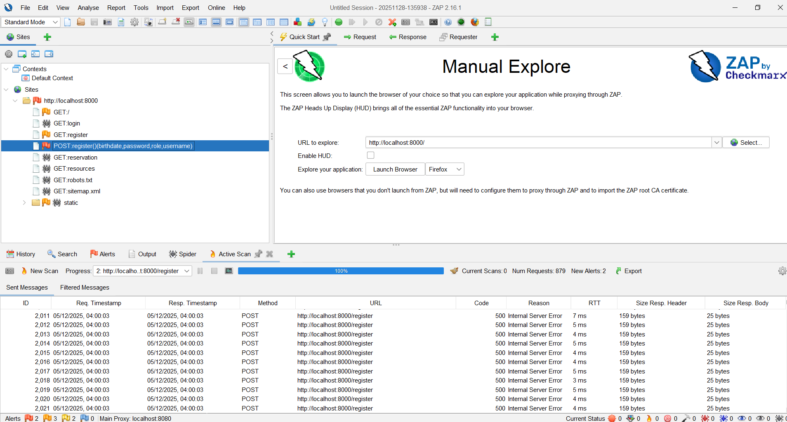

# ZAP Vulnerability Scan Report (Round 1)
**Date:** 2025-12-05  
**Tester:** Eguzoro Chikadibia  
**Target Application:** Booking System – Registration Page  
**URL Scanned:** http://localhost:8000/register  
**Tool Used:** OWASP ZAP 2.16.1  

---

# 1. Summary of Alerts

| Risk Level | Number of Alerts |
|-----------|------------------|
| 🔴 High   | 2 |
| 🟠 Medium | 3 |
| 🟡 Low    | 2 |
| 🔵 Info   | 0 |

---

# 2. High Severity Findings

---

## 🔴 2.1 SQL Injection
**Endpoint:** `POST http://localhost:8000/register`

**Description:**  
ZAP detected SQL injection behavior. The server returned **500 Internal Server Error** when injected payloads were submitted (e.g., `' OR '1'='1`, `"'--"`). This confirms that unvalidated input is being passed directly into SQL statements.

**Evidence:**  
- Multiple 500 responses in ZAP history  
- Payloads triggered backend SQL parser errors  

**Risk:**  
Attackers can bypass authentication, read/modify database data, or take full control of the system.

**Recommendation:**  
- Use parameterized queries  
- Sanitize all input  
- Validate data types and length  

---

## 🔴 2.2 Path Traversal
**Description:**  
ZAP detected path traversal payload responses during the scan.

**Risk:**  
Attackers may gain access to restricted files.

**Recommendation:**  
- Block `../` and encoded variants  
- Normalize server paths  
- Whitelist allowed file paths  

---

# 3. Medium Severity Findings

---

## 🟠 Missing Anti-CSRF Tokens
Forms do not contain any CSRF protection.

---

## 🟠 CSP Header Missing (3 instances)
No CSP header is set.

---

## 🟠 Missing Anti-Clickjacking Header
`X-Frame-Options` is missing.

---

# 4. Low Severity Findings

---

## 🟡 Application Error Disclosure
Backend errors reveal stack trace information.

---

## 🟡 X-Content-Type-Options Missing
Browser may MIME-sniff responses.

---

# 5. Conclusion
Critical vulnerabilities (SQL Injection + Path Traversal) were found.  
These must be fixed before Phase 2 verification.

---

# 6. Attachments
### 📌 ZAP Alerts Screenshot  

### 📌 ZAP Scan Logs  

