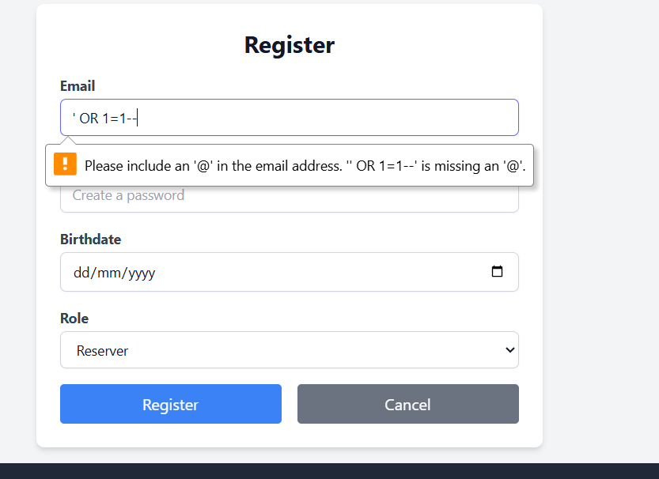
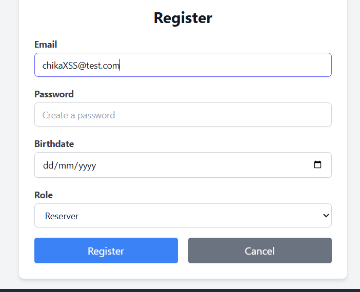
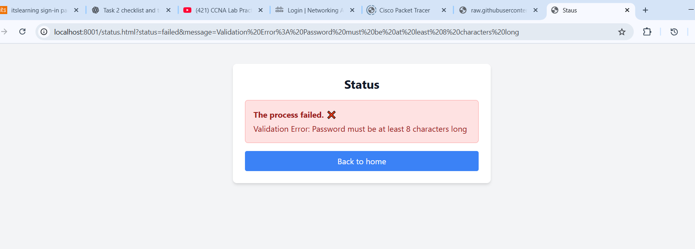
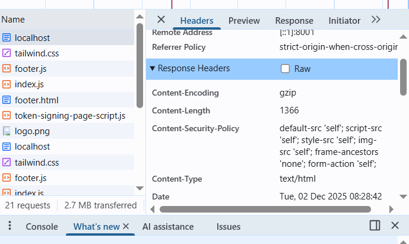
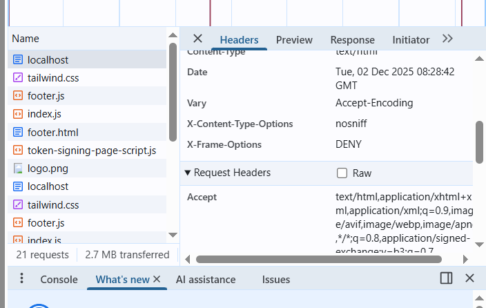

Round 2 – Verification of Top 5 Findings (From Phase 1 / Part 1)
#	Finding (Round 1)	Round 2 Test Steps	Observed Result	Status
F-01 – SQL Injection in Email Field (High)

Round 1 result: Email field accepted SQL payloads (e.g., ' OR 1=1--) causing SQL error.

Round 2 test:

Open Registration page

Enter email: ' OR 1=1--

Attempt to submit

Evidence:

Round 2 Observation:

The input was rejected by frontend email validation.

No SQL error occurred.

No injection was executed.

Status: ✅ Fixed

F-02 – Stored/Reflected XSS (High)

Round 1 result: Username field accepted 

Round 2 test:

Check registration form for username field

Attempt to inject XSS payload in text input

Observe login profile page for execution

Evidence:
 

Round 2 Observation:

Username field is removed in Phase 2.

No place to inject HTML/JS.

No XSS popup occurred.

Status: ✅ Fixed

F-03 – Weak Password Policy (Medium)

Round 1 result: Password allowed values such as "12345" or <5 characters.

Round 2 test:

Enter password shorter than 8 characters

Submit registration form

Observe validation result

Evidence:

Round 2 Observation:

Application blocked weak passwords.

Error: “Password must be at least 8 characters long.”

Status: ✅ Fixed

F-04 – Missing Security Headers (Low)

Round 1 result: Missing CSP, X-Frame-Options, X-Content-Type-Options

Round 2 test:

Open DevTools → Network

Select any HTML response

Check security headers

Evidence:

Round 2 Observation:
All essential headers are present:

Content-Security-Policy: ✔

X-Frame-Options: DENY ✔

X-Content-Type-Options: nosniff ✔

Status: ✅ Fixed

F-05 – Server Version Disclosure (Informational)

Round 1 result: Server revealed version in headers, allowing targeted attacks.

Round 2 test:

Inspect response headers

Look for X-Powered-By, server version, or framework leaks

Evidence:

(Your screenshot shows no server version.)

Round 2 Observation:

No X-Powered-By header

No server signature

No version information disclosed

Status: ✅ Fixed